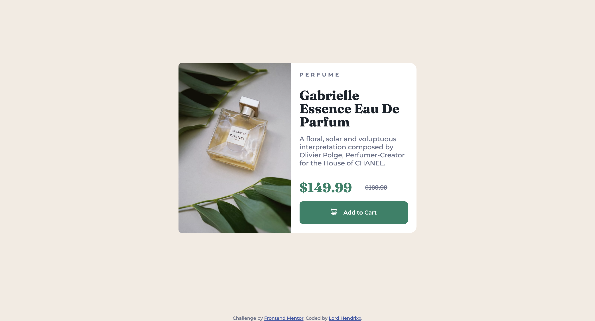

# Frontend Mentor - Product preview card component solution

This is a solution to the [Product preview card component challenge on Frontend Mentor](https://www.frontendmentor.io/challenges/product-preview-card-component-GO7UmttRfa). Frontend Mentor challenges help you improve your coding skills by building realistic projects. 

## Table of contents

- [Overview](#overview)
  - [The challenge](#the-challenge)
  - [Screenshot](#screenshot)
  - [Links](#links)
- [My process](#my-process)
  - [Built with](#built-with)
  - [What I learned](#what-i-learned)
  - [Continued development](#continued-development)
  - [Useful resources](#useful-resources)
- [Author](#author)
- [Acknowledgments](#acknowledgments)

## Overview

### The challenge

Users should be able to:

- View the optimal layout depending on their device's screen size
- See hover and focus states for interactive elements

### Screenshot

### Links

- Solution URL: [ Vercel ](https://product-preview-card-six-rho.vercel.app/)

## My process

### Built with

- Semantic HTML5 markup
- CSS custom properties
- Flexbox
- CSS Grid
- Mobile-first workflow

### What I learned

I learnt about the background image property and how to change it according to screen size.

### Continued development

I still feel with more practice i'd get a better understanding of responsive web design.

### Useful resources

- [Stack Overflow](https://www.stackoverflow.com) - I was having a hassle with changing images according to screen size and i was suggested a brilliant idea.

## Author

- Frontend Mentor - [Lord Hendrixx](https://www.frontendmentor.io/profile/beeAlmighty)
- Twitter - [@Maduakonam Moses](https://www.twitter.com/Maduakonam67451)

## Acknowledgments

- I want to appreciate stack overflow for its immense help and guidance to completing this project.
